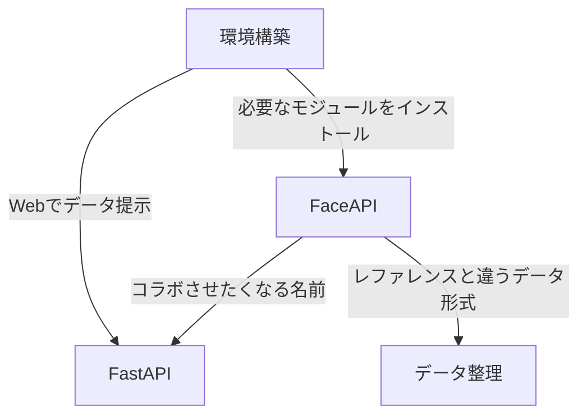
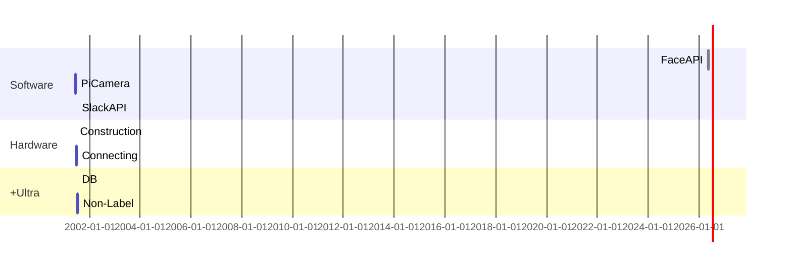

# 前半成果物発表

## __今回の目標__
機械学習で、俺を認識させる

### __目次__
1. 全体像
2. 取り組みについて
3. 必要だったスキル
4. これからについて
5. +Ultra

## __取り組みについて__
---
1. どうやって実装するか調べる
    >1. OpenCV
    >2. 他にもdlibというライブラリ
    >3. __FaceAPI__
2. Azureを利用する
    >1. 色々なサービスがあったので、色々使ってみる
    >2. FaceAPIで実装する
3. 自分が作りたいサービスにカスタマイズする
    >データを操ることが1番の苦戦ポイント
4. 【番外編】FastAPIとコラボ

## __必要だったスキル__
---

#### FaceAPI
>1. 顔を認識してくれる
>2. 学習して顔を識別してくれる
>3. 似つき具合を％で出してくれる
>4. その他にも感情を読み取る機能などもある

#### データの整理
>1. どこからデータを取るのか指定
>2. サンプルとなる資料の方法とは異なる拡張子

#### 環境構築
>1. .venvを使った
>2. 反省点はdockerで一からやる方が知見が広がった

#### FastAPI
>1. 加工したデータの提示をしてみたかった
>2. 自分で確かめたい画像をWeb上でアップロードする方が面白いが趣旨から離れるのでやめた

## __これからについて__
---
>1. Software
>2. Hardware
>3. +Ultra
